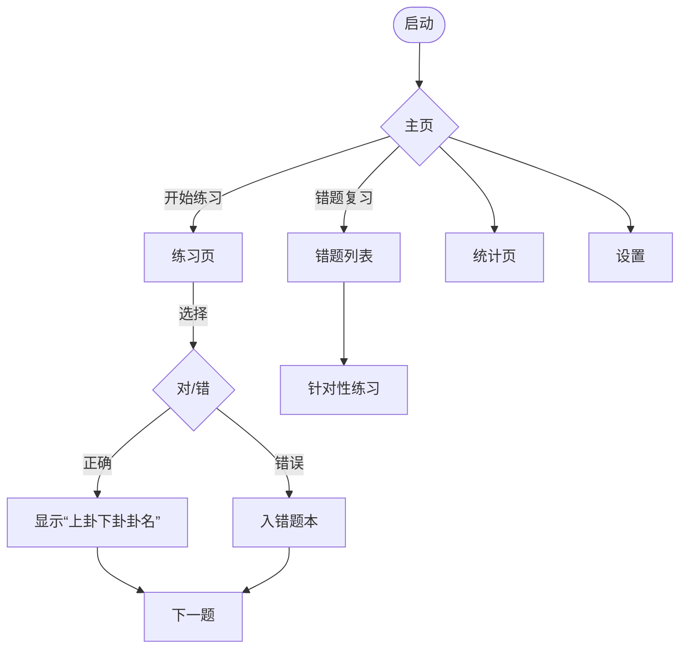

# 周易六十四卦记忆与复习 App｜式样书（Android·离线）v1.0

> 目标读者：产品经理、设计、开发、测试
>
> 发布日期：2025‑08‑31（草案 v1.0）

---

## 0. 我对需求的理解
- 平台：Android，完全离线可用（无需任何联网权限）。
- 目标：帮助用户**记忆并复习**六十四卦的**卦象↔卦名**对应关系，对标语言学习类 App 的交互与复习机制。
- 核心玩法：
  1) 随机展示一个卦象（题干），
  2) 给出 **5 个候选选项**（含 1 个正确答案），
  3) 选对后即时反馈并显示如“**水火未济**”的结构说明（上卦+下卦+卦名），
  4) 记录错题，支持错题复习，
  5) **尽可能保证等概率**出现每一卦（同频公平）。
- 内容基线：采用用户提供的 8×8 卦表（上卦×下卦→编号+卦名）。

---

## 1. 产品目标与成功指标
### 1.1 产品目标
- 用最少点击完成最多记忆：以「看图识名」为主，「即时反馈」+「错题本」+「间隔复习」。
- 离线与隐私：不采集个人数据，不联网，无广告。

### 1.2 关键指标（KPI）
- 学习日活完成率：每日目标（默认 30 题）完成率 ≥ 60%。
- 记忆覆盖度：7 日内至少被抽中的卦占比 ≥ 90%。
- 等概率度量：10,000 次抽题的卦频率方差 ≤ 5%（见 §10 质量标准）。
- 错题回落率：错题在 3 次复习后正确率 ≥ 80%。

---

## 2. 用户与场景
### 2.1 典型用户
- 初学者：刚接触卦名，对「图像—名称」映射陌生。
- 进阶者：掌握大部分卦名，需要保持熟悉度与反应速度。

### 2.2 场景
- 碎片学习（地铁、排队）
- 集中刷题（番茄钟 10~15 分钟）
- 错题回顾（睡前 5 分钟）

---

## 3. 范围（In/Out of Scope）
- **In**：卦象识别→卦名；等概率抽题；5 选 1；即时反馈；错题本；简单 SRS（间隔复习）；统计面板；深色模式；无障碍（TalkBack、字号）；本地化中文。
- **Out**：卦辞/爻辞详解、占筮功能、联网账户、云同步、多人排行。

---

## 4. 功能需求（Functional Requirements）

### F‑01 题目生成（等概率随机）
- 从 64 卦中按**等概率**抽取题目（详见 §6.1）。
- 一轮=64 题不重复；轮切换时重新洗牌。
- 允许模式切换：
  - **均衡模式**：严格等频（面向新手覆盖）。
  - **强化模式**：错题/遗忘权重略升，但**题干等频**，仅在**出场顺序**上加权（兼顾公平与强化）。

### F‑02 选项生成（5 选 1）
- 含 1 个正确 + 4 个干扰项；**选项位置均衡**（A~E 均匀分布，见 §6.3）。
- 干扰项策略（减少“瞟一眼就会”）：
  1) **同上卦**优先抽 2 个；
  2) **同下卦**优先抽 1 个；
  3) 其余随机 1 个；
  4) 与最近 5 题避免重复干扰项。
- 文本样式：显示**编号+卦名**（如「64 未济」）或仅卦名（设置可选）。

### F‑03 答题反馈
- 选对：震动轻反馈 + 展示 **「上卦名+下卦名+卦名」**（例：「水火未济」或「坎离未济」），并显示编号（例：64）。
- 选错：标记错误项并高亮正确项；记录错因（题干→选错的选项）。
- 可切换「自动下一题」或「点击继续」。

### F‑04 错题本与复习
- 自动收集错题；支持「全部错题重练」「最近 7 天错题」「高频错题」。
- 错题在**同轮**中不重复二次考核；进入下一轮后根据 SRS 调度（§6.4）。
- 支持从题目详情页查看本题的「上卦/下卦」与相邻易混卦列表。

### F‑05 学习与考试模式
- **练习模式**：无限时、即时反馈。
- **计时模式**：60/120 秒限时，正确连击有额外奖励（激励但不影响等频）。
- **考试模式**：固定 20/40/64 题，结束后统一成绩单。

### F‑06 统计与进度
- 展示：今日完成、正确率、近 7 日学习时长、卦覆盖度、错题热力。
- 本地化存储，支持导出为 JSON 到本地（可选）。

### F‑07 设置
- 每日目标题量、是否显示编号、是否自动跳题、震动与音效开关、深浅色、字号。

### F‑08 无障碍
- TalkBack 可读；语义化标签；触控靶≥48dp；对比度≥4.5:1；动态文字尺寸。

### F‑09 隐私与权限
- **零权限**（不申请网络、定位、通讯录等）；
- 仅在启用「本地导出」时请求存储写入权限（scoped storage）。

### F‑10 稳定性
- 后台/前台切换不丢题；异常退出自动恢复到上一题；
- 所有持久化写入采用事务；关键写入有双写校验（见 §5）。

---

## 5. 数据模型（离线）
> 存储：Android Room（SQLite），初始数据随 APK 内置 JSON。

**实体与字段（简表）**
- `hexagram`（64 条）
  - `id` INT 主键（1..64）
  - `name_zh` TEXT（如“未济”）
  - `upper_trigram` TEXT（“坎/离/…”）
  - `lower_trigram` TEXT
  - `upper_elem` TEXT（“水/火/…”）
  - `lower_elem` TEXT
  - `king_wen_index` INT（冗余与 id 同步）
  - `lines_bits` TEXT（自上而下 6 位 0/1，用于程序化绘制）

- `attempt`（作答记录）
  - `id` PK，自增；`hexagram_id`；`ts`；`is_correct`；`options`（JSON 数组）

- `wrong_book`（错题索引）
  - `hexagram_id`；`wrong_count`；`last_wrong_ts`

- `srs_state`（间隔复习状态）
  - `hexagram_id`；`bucket`（Leitner 1..5）；`due_ts`

- `app_pref`（设置）
  - KV 结构；含「每日目标」「是否显示编号」「主题」等

**一致性**：所有引用字段有外键约束；关键表写入事务化。

---

## 6. 核心算法设计

### 6.1 等概率抽题（Deck 洗牌法）
- **思想**：将 64 卦视为一副“牌”，每轮开始时**一次性洗牌**（Fisher‑Yates），按序取用；保证**一轮内不重复**且频次完全均匀；跨轮长期均匀。
- **强化模式**：保持同样的 64 张牌，但使用**稳定洗牌+轻度重排**：将「错题/高遗忘分」的牌在本轮末尾做**微调前移**（最多前移 20% 位置），不改变同轮唯一性；从而既保证总体均衡又略向难点倾斜。
- **评估**：记录每 64×N 次后的频率方差；若>阈值，发出开发侧诊断提示。

### 6.2 选项生成策略
- 目标：**高辨析但不陷阱**。
- 过程：
  1) 从同上卦集合随机取 2 个不同于正确项；
  2) 从同下卦集合随机取 1 个；
  3) 从全局剩余中取 1 个；
  4) 去重；若不足则从全局补齐；
  5) 如「同上/同下」集合不足，自动降级策略。

### 6.3 正确选项位均衡
- 维护一个长度 5 的循环指针（A→E→A…), 每题将正解放到下一位置；若用户切换模式或重开轮，指针保留，长期看 5 位近似均等。

### 6.4 间隔复习（Leitner 简化）
- 新题默认放入 **盒 2**；答对→进 1 盒（最高 5）；答错→回 **盒 1**。
- 复习优先级：盒序低→高；同盒按 `due_ts` 升序。
- `due_ts` 计算：盒 1（今日+0h）、盒 2（+1d）、盒 3（+3d）、盒 4（+7d）、盒 5（+14d）。
- 与等概率协调：
  - **题干仍从 Deck 均衡产生**；SRS 仅影响**练习顺序**与**复习列表**；
  - 在「错题复习」专用模式下，抽取来源限定为错题集（不计入等概率 KPI）。

---

## 7. 交互流程与界面

### 7.1 主要页面
1) **主页**：开始练习 / 错题复习 / 统计 / 设置。
2) **练习页**：上方显示**卦象图**（程序化 6 爻绘制，支持放大），下方 5 个选项按钮。
3) **反馈层**：
   - 选对：显示「上卦+下卦+卦名（编号）」；
   - 选错：红/绿标注 + 正确项说明；
4) **错题本**：列表（按错频排序）→单题详情（相似卦推荐）。
5) **统计页**：折线/柱状（近 7 日完成、正确率、覆盖度、错题热力）。
6) **设置页**：见 F‑07。

### 7.2 用户路径（Mermaid）


### 7.3 视觉与可用性
- Jetpack Compose，Material 3；深色/浅色；字号可调；按钮≥48dp。
- 卦象绘制：矢量/Canvas（6 条爻，老阴/少阴统一为**阴爻断线**，老阳/少阳统一为**阳爻实线**，本版本不区分动爻）。

---

## 8. 技术架构
- 语言：Kotlin；架构：MVVM + Repository。
- UI：Jetpack Compose；导航：Navigation Compose。
- 本地：Room / DataStore Preferences。
- 依赖：不引入联网库；不接入崩溃/分析 SDK；
- 最低系统：Android 8.0（API 26），目标 API：最新稳定版。
- 包体：≤ 15 MB（含数据）。

---

## 9. 性能与质量
- 冷启动 ≤ 800ms；页面切换 ≤ 200ms；
- 10,000 次自动化抽题模拟内存泄漏为 0，ANR 为 0；
- 数据库操作均在 IO 线程；绘制与动画在主线程；
- 单元测试覆盖核心算法（§6）；UI 测试覆盖关键路径。

---

## 10. 验收与测试

### 10.1 功能验收（摘录）
- **等概率**：运行 10,240 题（160 轮），各卦频次标准差/均值 ≤ 5%。
- **选项位置均衡**：10,000 题中 A~E 为正确的占比差异 ≤ 3%。
- **错题本**：错题加入/移除逻辑正确；同轮不重复二次考核。
- **反馈文案**：格式严格为「上卦名+下卦名+卦名」（例：水火未济）。

### 10.2 边界用例
- 屏幕旋转、应用被杀、低电量模式、存储空间不足、首轮未满/跨轮切换。

### 10.3 自动化与工具
- 仿真脚本：模拟 10,000 次抽题与答题，导出频率分布（开发内用）。

---

## 11. 发布与版本
- v1.0：单人学习 + 错题本 + 统计 + 等概率 + 简化 SRS。
- v1.1（可选）：导出/导入学习进度；英文 UI；更多统计图表。

---

## 12. 内容规范与展示规则
- 题干只显示**卦象图**（默认不显示文字提示）。
- 选项默认显示「编号+卦名」（例：64 未济）；可在设置中关闭编号。
- 反馈层统一格式：「**上卦元素+下卦元素+卦名**」，如：
  - 63：**水火既济**（上=坎=水；下=离=火）
  - 64：**火水未济**（上=离=火；下=坎=水）

---

## 13. 术语与八卦映射
- 八卦→五行/自然意象（用于显示「水火未济」）：
  - 乾=天、兑=泽、离=火、震=雷、巽=风、坎=水、艮=山、坤=地。

---

## 14. 附录 A：64 卦一览（上×下）
> 采用用户提供矩阵，记号：**上卦**为列标题，**下卦**为行标题。

| 下\上 | 坤 | 艮 | 坎 | 巽 | 震 | 离 | 兑 | 乾 |
|---|---|---|---|---|---|---|---|---|
| **坤** | 2 坤为地 | 23 山地剥 | 8 水地比 | 20 风地观 | 16 雷地豫 | 35 火地晋 | 45 泽地萃 | 12 天地否 |
| **艮** | 15 地山谦 | 52 艮为山 | 39 水山蹇 | 53 风山渐 | 62 雷山小过 | 56 火山旅 | 31 泽山咸 | 33 天山遁 |
| **坎** | 7 地水师 | 4 山水蒙 | 29 坎为水 | 59 风水涣 | 40 雷水解 | 64 火水未济 | 47 泽水困 | 6 天水讼 |
| **巽** | 46 地风升 | 18 山风蛊 | 48 水风井 | 57 巽为风 | 32 雷风恒 | 50 火风鼎 | 28 泽风大过 | 44 天风姤 |
| **震** | 24 地雷复 | 27 山雷颐 | 3 水雷屯 | 42 风雷益 | 51 震为雷 | 21 火雷噬嗑 | 17 泽雷随 | 25 天雷无妄 |
| **离** | 36 地火明夷 | 22 山火贲 | 63 水火既济 | 37 风火家人 | 55 雷火丰 | 30 离为火 | 49 泽火革 | 13 天火同人 |
| **兑** | 19 地泽临 | 41 山泽损 | 60 水泽节 | 61 风泽中孚 | 54 雷泽归妹 | 38 火泽睽 | 58 兑为泽 | 10 天泽履 |
| **乾** | 11 地天泰 | 26 山天大畜 | 5 水天需 | 9 风天小畜 | 34 雷天大壮 | 14 火天大有 | 43 泽天夬 | 1 乾为天 |

---

## 15. 附录 B：示例伪代码（算法意图）

**Deck 洗牌（每轮）**
```
deck = [1..64]
shuffle(deck) // Fisher-Yates
pointer = 0
nextQuestion():
  if pointer >= 64:
    shuffle(deck); pointer = 0
  qid = deck[pointer]; pointer += 1
  return qid
```

**干扰项生成**
```
distractors = []
# 取同上卦 2 个
candidates1 = all where upper == q.upper and id != q.id
pick 2 unique from candidates1 into distractors
# 取同下卦 1 个
candidates2 = all where lower == q.lower and id not in {q.id, distractors}
pick 1 unique from candidates2 into distractors
# 全局补齐 1 个
candidates3 = all where id not in {q.id, distractors}
pick 1 unique into distractors
# 打乱正确项位置：A..E 循环指针
```

**Leitner SRS（简化）**
```
onAnswer(q, correct):
  if correct:
    srs[q].bucket = min(5, srs[q].bucket + 1)
  else:
    srs[q].bucket = 1; wrong_book.add(q)
  srs[q].due_ts = now + interval_of_bucket(srs[q].bucket)
```

---

## 16. 追踪与变更管理
- 本式样书版本以 Git 维护；每次变更更新版本号与修订历史。

**修订历史**
- v1.0（2025‑08‑31）：初版草案。

